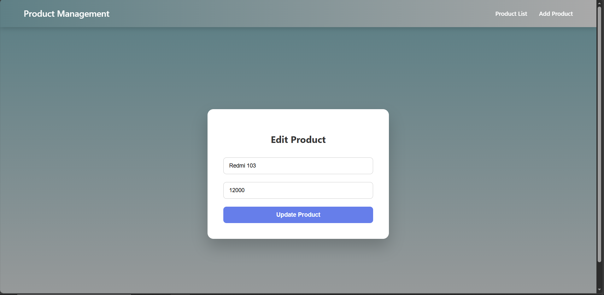
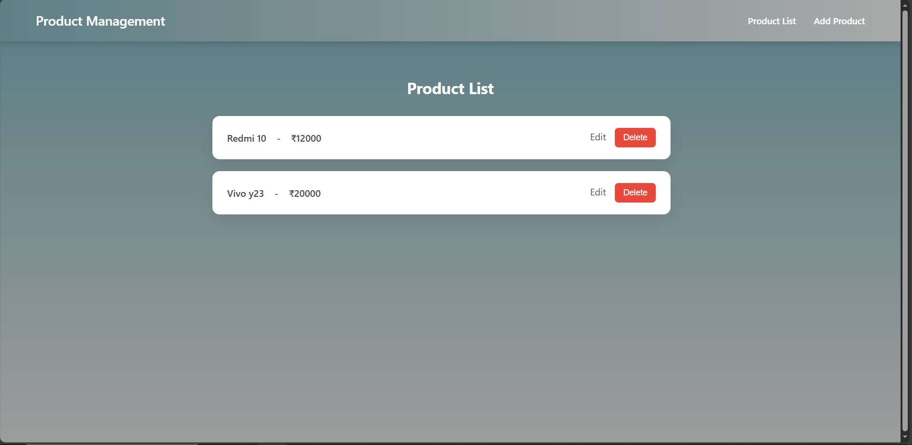

# 🚀 Task 2 – React Frontend Integration  
## Product Management System

A React frontend application that consumes the Express CRUD API (Task 1) to manage products.

---

## ✨ Features

- View all products
- Add new product
- Edit existing product
- Delete product
- Client-side routing
- REST API integration

---

## 🛠 Tech Stack

- React.js
- React Router DOM
- Axios
- Node.js (Backend API)
- Express.js
- MongoDB


---

## ⚙️ Setup Instructions

```bash
npm install
npm start
```
---

## 📸 Screenshots






